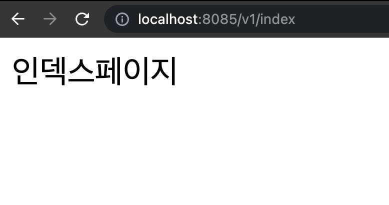
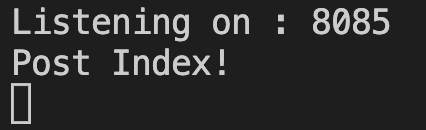
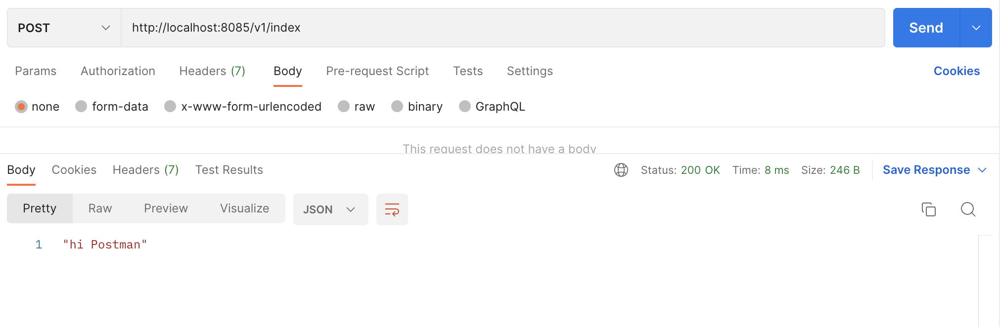
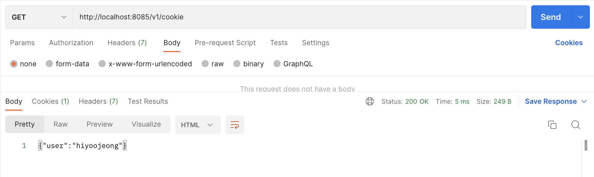
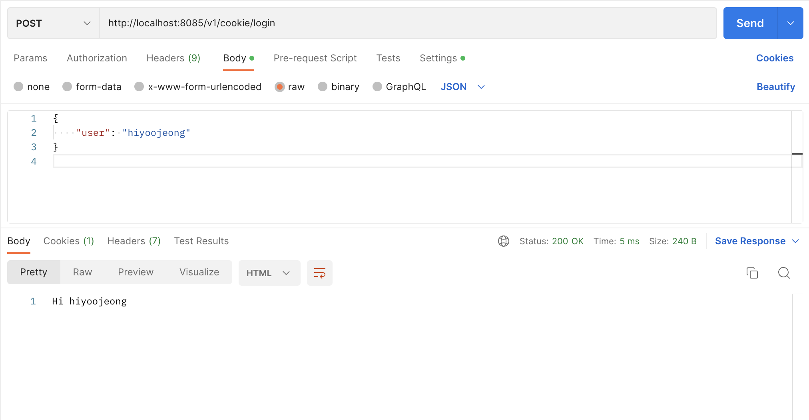
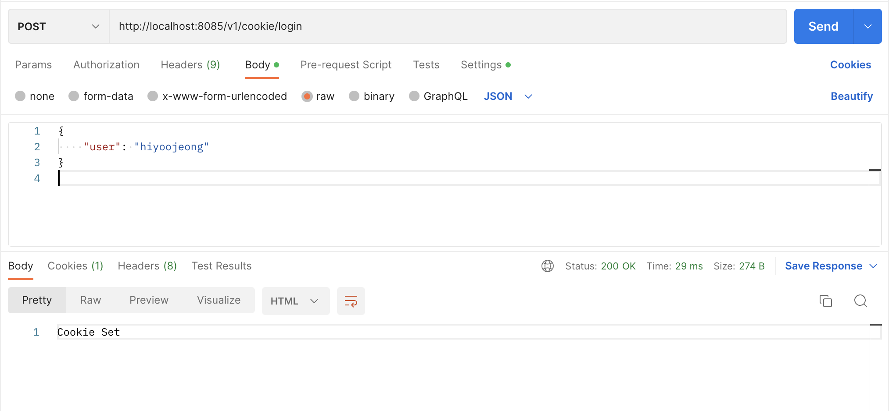
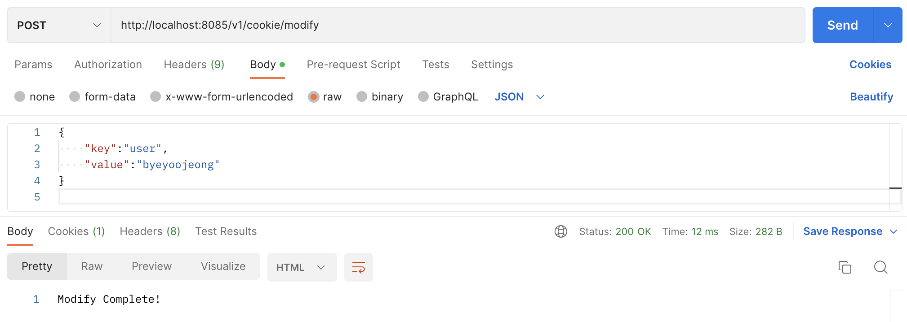
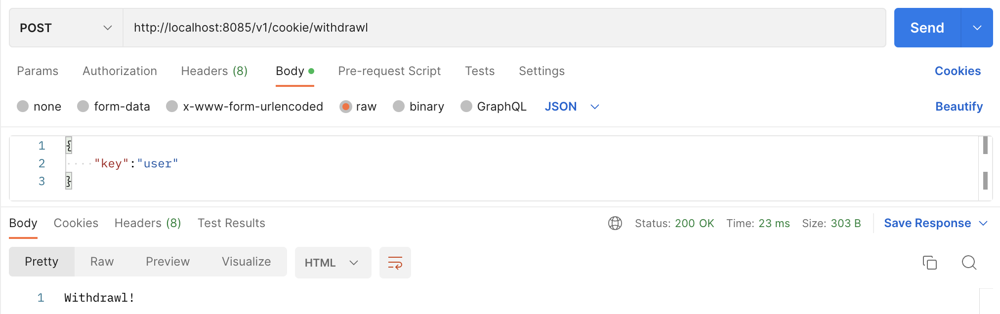

### WEEK1: 기본적인 Server 구동
---

**1. v1/index로 get 요청을 보내면, 브라우저에 "인덱스 페이지"가 출력된다.**   
   

**2. v1/index로 post 요청을 보내면, 콘솔창에는 port 번호 브라우저에는 "hi Postman"이 출력된다.**   
콘솔창  
   
브라우저   
   

**3. v1/cookie로 get 요청을 보내면, 쿠키 정보가 json 형식으로 출력된다.**   
   

**4. v1/cookie/login로 post 요청을 보난다.**   
**4-1. key가 user인 cookie 정보가 있다면, "Hi" + ${user cookie value} 출력**   
   
**4-2. key가 user인 cookie 정보가 없다면, user cookie 생성**   
   

**5. v1/cookie/modify로 post 요청을 보내면, user cookie를 수정한다.**   
   

**6. v1/cookie/withdrawl post 요청을 보내면, user cookie를 삭제한다.**   
   

