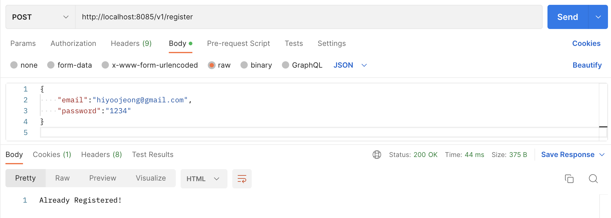
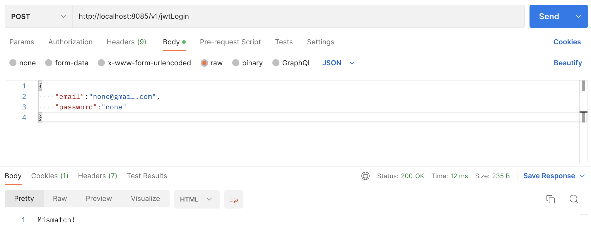

### WEEK1: MySQL DB 연동, ORM(Sequelize), JWT, Session, 소셜로그인(카카오, 네이버)
---

**1. MySQL DB 연동**   
   

**2. 로그인**   
**2-1. 사용자 정보 등록하기**   
v1/register로 post 요청을 보내면, 사용자 정보를 등록한다. 이미 존재하는 사용자 정보라면 등록하지 않는다.   
   
   
**2-2. JWT 로그인**   
v1/jwtLogin로 post 요청을 보내면, 로그인한다. 존재하지 않는 사용자 정보라면 로그인하지 않는다.   
   
   
v1/jwtVerify로 post 요청을 보내면, 로그인 중인 사용자 정보를 출력한다. token이 존재하지 않다면 출력하지 않는다.   
   
**2-3. Session 로그인**   
v1/sessionLogin로 post 요청을 보내면, 로그인한다. 존재하지 않는 사용자 정보라면 로그인하지 않는다.   
   
   
v1/sessionVerify로 post 요청을 보내면, 로그인 중인 사용자 정보를 출력한다. 세션이 존재하지 않다면 출력하지 않는다.   
   

**3. 소셜로그인**
**3-1. 카카오 로그인**