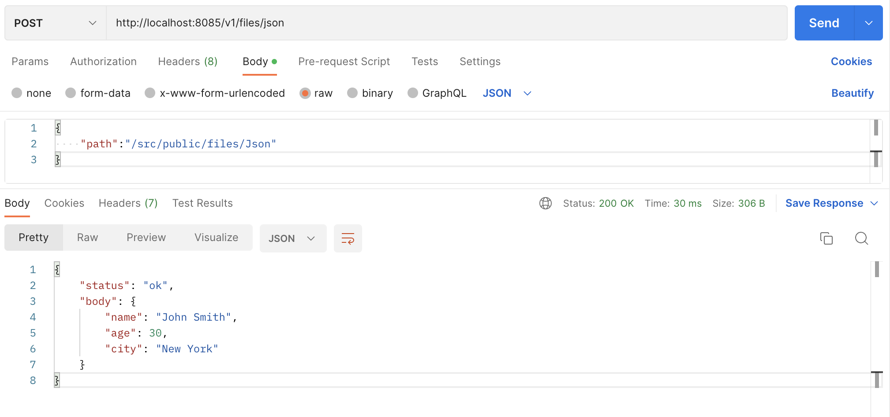
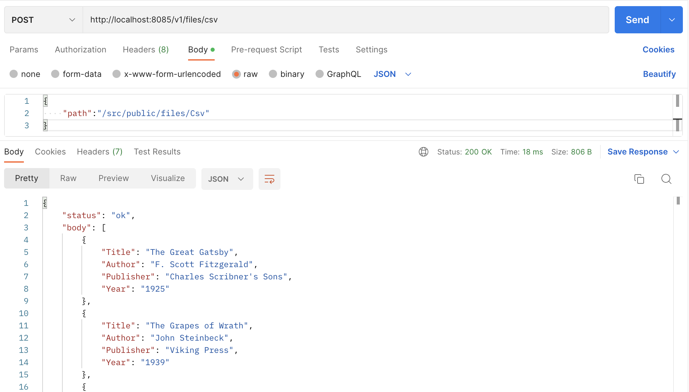
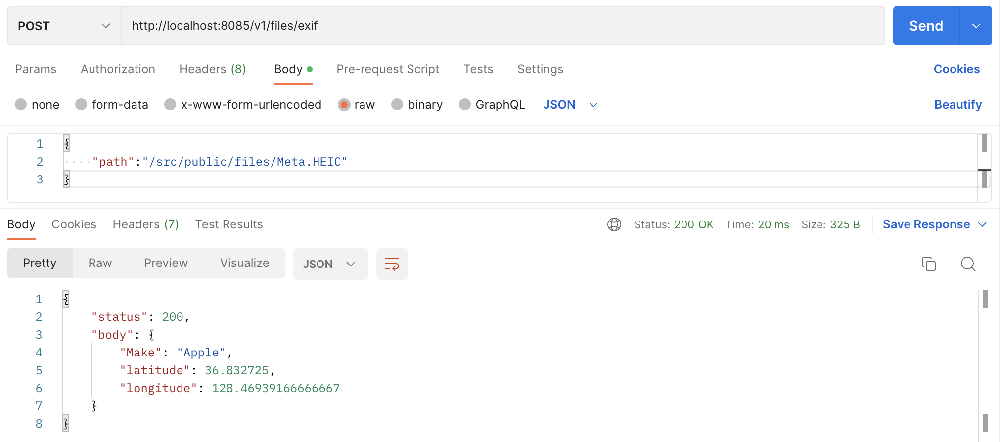

### WEEK3: 여러 종류 파일 읽기(json, xml, csv, yaml, exif)
---

**1. json**   
v1/files/json으로 post 요청을 보낸다.   
path 경로에 있는 json 파일을 읽은 뒤, json으로 response한다.   
   

**2. xml**   
v1/files/xml로 post 요청을 보낸다.   
path 경로에 있는 xml 파일을 읽은 뒤, json으로 response한다.     
>npm install xml-js

   

**3. csv**   
v1/files/csv로 post 요청을 보낸다.   
path 경로에 있는 csv 파일을 읽은 뒤, json으로 response한다.    
>npm install csvtojson

   

**4. yaml**   
v1/files/yaml로 post 요청을 보낸다.   
path 경로에 있는 yaml 파일을 읽은 뒤, json으로 response한다.   
>npm install js-yaml

   

**5. exif**   
v1/files/exif로 post 요청을 보낸다.   
path 경로에 있는 exif 파일을 읽은 뒤, json으로 response한다.   
>npm install exifreader  

   